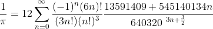
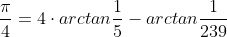
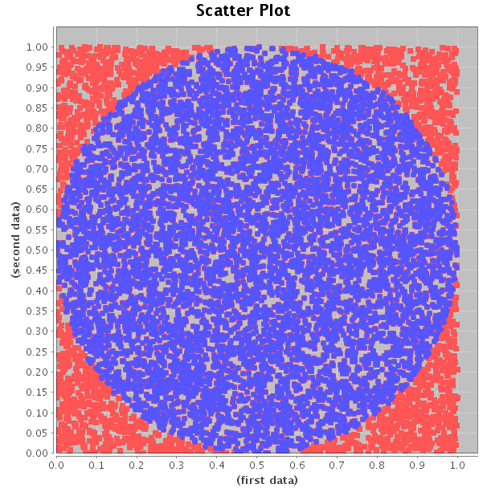
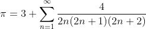
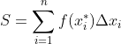

# calculating_pi
This is a repository for uploading the various methods I've used in calculating pi  

## Chudnovsky Method

이 방법은 그래도 준수한 수준의 오차율을 보여주었다. 식의 n 값을 높이면 높일수록 오차율이 줄어들었어야 하나, 실제로는 이렇지 않고, n 값이 약 15부터는 원주율 값이 동일하게 출력되는 것을 볼 수 있다. 또한 n 값이 너무 커지면 Windows Powershell에서 값이 너무 크다고 계산을 거부하는 것도 볼 수 있다. 

## Machin's Derivation

`Machin's Derivation`이 가장 큰 오차를 보여주었는데, 약 3.183의 값을 보이며, 원주율과는 매우 큰 거리의 값을 출력해주었다. 이는 아마도 다른 방식들과는 달리 지속적인 계산이 아닌, 한번의 계산을 하는 것이기 때문에 큰 오차가 나타나는 것이 아닐까 생각된다. 

## Monte Carlo Approach

처음에 시도했던 방법이 이 `Monte Carlo Approach`이다. 하지만 워낙 랜덤성이 강하고, 완벽히 정확한 값을 구하기에는 무작위성이 강한 방법이라, 우리가 구하고자하는 원주율 값에 가까이 갈 때도 있었지만, 작게는 0.01에서 크게는 0.03까지 차이나는 경우도 볼 수 있었다. 

## Nilakantha Series

이 방법이 실제로는 가장 근접한 값을 나타내주었다. `while문`을 통해 사용자가 `break`할 때까지 지속적으로 더 나아지는 계산 값을 볼 수 있는데, 실제로 이를 Windows Powershell에서 실행시키면 소숫점 한자리 한자리씩 고정되면서 뒤의 숫자들이 계속 계산되는 것을 볼 수 있다. 충분한 시간만 있으면 원하는 만큼 소숫점을 나타낼 수 있지 않을까 생각된다. 

## Riemann Sum

리만 합을 구하는 과정에는, `num_rectangle` 값이 커지면 커질 수록, 계산하는 시간이 비약적으로 늘어나는 것을 볼 수 있었다. 물론 `num_rectangle`이 커질수록 정확도도 더욱 더 높아지긴 했다. 하지만 그에 따라 시간이 너무 오래 걸려 계산을 지속적으로 하고 있는 것을 볼 수 있따.. 실제로 `num_rectangle`이 약 100,000,000가 되자, Windows Powershell에서는 지속적으로 계산만 하면서 대기중으로 뜰 뿐, Powershell을 나갈때까지 다른 출력값을 보기는 힘들었다. 